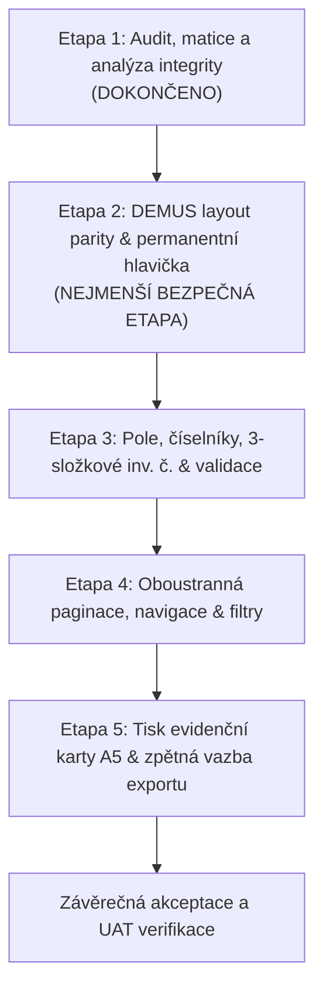

# CURATAS – Implementační plán (CITEM 24. 9. 2026)

**Datum zpracování:** 3. října 2026  
**Cíl:** Fázovaná adaptace frontendu CURATAS na závazné závěry jednání CITEM ze dne 24. 9. 2026 při 100% zachování stability, existujících kontraktů a UAT subpath kompatibility.  
**Výchozí větev:** `fix/uat-subpath` (bude vytvořena pracovní větev `feature/citem-demus-ui-24092026`)  

---

## 1. Strategie fázování

Implementační proces je rozdělen do pěti logicky navazujících a nezávisle testovatelných etap. Pořadí respektuje prioritu stanovenou zadavatelem a minimalizuje riziko regresí.

---

## 2. Rozpad jednotlivých etap

---

### ETAPA 1: Technický audit, matice požadavků a analýza rizik (DOKONČENO)
- **Cíl:** Detailní read-only prozkoumání FE a BE repozitářů, zmapování odchylek, identifikace rizik a definice závazných dokumentů.
- **Výstupy:**
  - `ARCHITECTURE_AUDIT.md`
  - `CITEM_REQUIREMENTS_MATRIX.md`
  - `API_DEPENDENCIES.md`
  - `DATA_INTEGRITY_RISKS.md`
  - `IMPLEMENTATION_PLAN.md`
- **Stav:** Kompletně hotovo bez zásahu do zdrojového kódu a DB.

---

### ETAPA 2: DEMUS layout parity & permanentní identifikační hlavička (NAVRHOVANÁ PRVNÍ IMPLEMENTAČNÍ ETAPA)
- **Cíl:**
  1. Odstranění termínu „exponát“ a nahrazení správnou muzejní terminologií „sbírkový předmět“ / „předmět“.
  2. Implementace **permanentní (sticky) identifikační hlavičky** v detailu a editaci předmětu (Fond, Předmět, Popis, Titul, Autor, Datace).
  3. Základní zhutnění layoutu formuláře a seznamu (snížení zbytečných paddingů a mezer pro zvýšení informační hustoty ve stylu DEMUS).
  4. Umístění viditelného tlačítka **„Zpět na seznam“** do horní části obrazovky předmětu se zachováním vyhledávacího kontextu.
- **Dotčené soubory:**
  - `src/App.tsx` (terminologie v navigaci a drobečkách)
  - `src/pages/AdminItems.tsx` (terminologie, zhutnění řádků tabulky)
  - `src/pages/AdminItemForm.tsx` (permanentní hlavička, tlačítko Zpět nahoře, terminologie, zhutnění mřížky)
  - `src/pages/Detail.tsx` (terminologie, layout)
  - `src/components/PermanentIdentificationHeader.tsx` (nová komponenta)
  - `src/pages/Catalog.tsx` (terminologie)
- **Kritéria úspěchu a verifikace:**
  - `npm run typecheck` bez chyb.
  - Všechny existující testy (67 testů) procházejí.
  - Nové unit testy pro `PermanentIdentificationHeader` (zobrazení všech 6 polí, ořez dlouhých textů, responzivita).
  - Test návratu z editace na přesnou stránku seznamu přes horní tlačítko „Zpět na seznam“.
  - Žádné pole formuláře není překryto plovoucí hlavičkou.
- **Odhad složitosti:** 1–2 dny.

---

### ETAPA 3: Názvy polí, oddělení Fondu a Podsbírky, 3-komponentové inv. č. a nová validační pravidla
- **Cíl:**
  1. **Nezávislá pole Fond a Podsbírka:**
     - Rozdělení sloučeného pole v `AdminItemForm.tsx`.
     - Vytvoření samostatného selektoru pro Fond (`dict_type = 'FUND'`) a samostatného pole pro Podsbírku (`subCollection`).
     - Správné mapování do payloadu (`fundDictionaryId` vs. `subCollection`).
  2. **Inventární číslo ze 3 komponent:**
     - Tříprvkový editor: Prefix / Hlavní číslo / Postfix.
     - Bezpečné skládání a nedestruktivní rozklad (fallback pro nestandardní formáty).
     - Asynchronní ověřování unikátnosti složeného čísla.
  3. **Oprava povinných polí a validačních pravidel:**
     - Inventární číslo je **povinné** (`required *`).
     - Přírůstkové číslo je **nepovinné** (odstranění `required`).
     - Alespoň jedno z polí Typ předmětu (`objectType`) a Název předmětu (`title`) musí být vyplněno.
     - Bezpečné přemostění pro backend (`title = objectType`, pokud je název prázdný).
  4. **Odstranění duplicit Markantu a Signatury:**
     - Jednoznačné umístění v primárním formuláři jako textová pole; odstranění matoucích duplicit v muzejní podsekci.
- **Dotčené soubory:**
  - `src/pages/AdminItemForm.tsx`
  - `src/lib/inventoryNumberUtils.ts` (nový pomocný modul s unit testy)
  - `src/components/InventoryNumberInput.tsx` (nová komponenta pro 3 složky)
  - `src/components/MuseumSection.tsx`
  - `src/lib/api.ts`
- **Kritéria úspěchu a verifikace:**
  - Unit testy pro parsování a syntézu inventárních čísel včetně extrémních případů (`DATA_INTEGRITY_RISKS.md`).
  - Test validace: formulář nedovolí odeslání bez inventárního čísla; dovolí odeslání bez přírůstkového čísla; ověření kombinace Typ/Název.
  - Test nezávislého uložení Fondu a Podsbírky a ověření správného JSON payloadu.
- **Odhad složitosti:** 2 dny.

---

### ETAPA 4: Oboustranná paginace, přímý skok na stranu a pokročilé filtry
- **Cíl:**
  1. **Oboustranná paginace:**
     - Zobrazení ovládacích prvků stránkování nahoře nad tabulkou i dole pod tabulkou.
     - Vzájemná obousměrná synchronizace stavu.
  2. **Přímý skok na číslo stránky:**
     - Editovatelné numerické pole (např. `Strana [ 14 ] z 240`).
     - Okamžitý přechod po stisku klávesy Enter nebo opuštění pole (blur).
     - Validace mezí (automatická korekce hodnot < 1 na 1 a hodnot > maxPage na maxPage).
  3. **Pokročilé vyhledávání a filtry:**
     - Přidání pole **Fond** do rychlých filtrů a do `AdvancedFilterBuilder.tsx`.
     - Přidání podpory pro pole **Zapsal** a **Určil** do UI filtrů.
     - Příprava pro server-side zpracování (s dokumentovaným požadavkem na BE tým).
- **Dotčené soubory:**
  - `src/pages/AdminItems.tsx`
  - `src/components/PaginationControls.tsx` (nová sdílená komponenta)
  - `src/components/AdvancedFilterBuilder.tsx`
- **Kritéria úspěchu a verifikace:**
  - Test synchronizace horní a dolní paginace.
  - Test přímého skoku na číslo stránky včetně mezních a nečíselných vstupů.
  - Test zachování vyhledávacích parametrů v URL a session storage.
- **Odhad složitosti:** 1–2 dny.

---

### ETAPA 5: Tisk evidenční karty A5 landscape a vizuální zpětná vazba exportu
- **Cíl:**
  1. **Tisk evidenční karty DEMUS A5 na šířku (landscape):**
     - Nová tisková komponenta implementující přesný layout A5 karty.
     - Dedikované CSS pravidlo `@page { size: A5 landscape; margin: 8mm; }`.
     - Varianta 2× A5 na list A4.
     - Možnost volby mezi novou A5 kartou a původním A4 tiskem (zachování stávající funkčnosti).
  2. **Vizuální stav a zpětná vazba exportu do Excelu:**
     - Lokální stav `isExporting` v `AdminItems.tsx`.
     - Vizuální spinner na tlačítku během generování a stahování.
     - Deaktivace tlačítka proti duplicitnímu kliknutí.
     - Zobrazení toast notifikace o úspěšném stažení nebo srozumitelné chybové hlášky při selhání.
- **Dotčené soubory:**
  - `src/components/MuseumCardPrintA5.tsx` (nová komponenta)
  - `src/pages/AdminItemForm.tsx` (volba formátu tisku A5 vs. A4)
  - `src/pages/AdminItems.tsx` (export feedback a tisk)
  - `src/components/ItemListPrint.tsx`
- **Kritéria úspěchu a verifikace:**
  - Tiskový náhled v Chrome/Edge/Firefox otevře orientaci landscape s rozměry A5 bez přetečení na druhou stranu.
  - Test vizuálního stavu exportu: tlačítko se uzamkne, zobrazí animaci a po dokončení se odemkne.
  - Zákaz simulace úspěchu – soubor se skutečně stáhne přes streamovaný endpoint.
- **Odhad složitosti:** 2 dny.

---

## 3. Návrh nejmenší bezpečné první implementační etapy

Jako **nejmenší bezpečnou první etapu (Etapa 2)** navrhujeme:

1. **Vytvoření větve `feature/citem-demus-ui-24092026`** z baseline `fix/uat-subpath`.
2. **Revize terminologie:** Důsledné nahrazení slova „exponát“ termínem „sbírkový předmět“ nebo „předmět“ v celém uživatelském rozhraní.
3. **Permanentní identifikační hlavička (`PermanentIdentificationHeader`):**
   - Vytvoření komponenty zobrazující Fond, Předmět, Popis, Titul, Autor, Datace.
   - Plovoucí (sticky) ukotvení pod hlavní navigační lištou v `AdminItemForm.tsx`.
   - Zkracování dlouhých textů s tooltipem.
4. **Horní akce „Zpět na seznam“:** Umístění tlačítka pro návrat do seznamu do horní části formuláře vedle editačních akcí.
5. **Základní zhuštění layoutu:** Snížení vertikálních mezer a paddingů ve formuláři pro lepší informační hustotu.

### Proč právě tato etapa jako první?
- **Nulové riziko datové ztráty:** Nemění logiku ukládání, parsování ani perzistenci čísel.
- **Okamžitá vizuální a ergonomická hodnota:** Kurátor ihned vidí posun k DEMUS paritě, neztrácí kontext díky permanentní hlavičce a má pohodlnou navigaci zpět.
- **Nezávislost na backendu:** Využívá výhradně již dostupná data v detailu předmětu.
- **Snadná a rychlá verifikace:** Umožňuje rychlé předvedení kurátorům a CITEM k průběžné validaci směru úprav.
